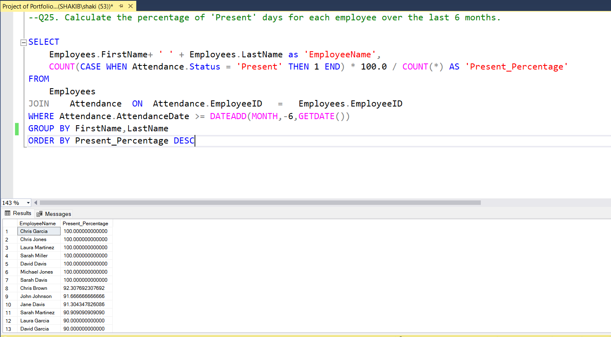

#  HR-Employee-Database-SQL
SQL project for HR employee database with 25 queries (joins, aggregations, subqueries, window functions, HR analytics

 # HR / Employee Database Project

This project is a **SQL-based HR database system** created for portfolio and learning purposes.  
It simulates a real-world HR setup with multiple tables and queries to analyze employee-related data.

## 📂 Project Overview
The database contains the following tables:
- **Employees** – Employee details (ID, Name, Department, etc.)
- **Departments** – Department information
- **Salaries** – Employee salary records
- **Performance** – Employee performance reviews
- **Attendance** – Daily attendance records

## 🛠️ Features & Queries
The project includes **25 SQL queries** that cover:
- Basic data retrieval (`SELECT`, `WHERE`)
- Aggregations (`COUNT`, `SUM`, `AVG`, `MIN`, `MAX`)
- Joins between multiple tables
- Grouping and filtering (`GROUP BY`, `HAVING`)
- Subqueries and CTEs
- Window functions (`RANK()`, `OVER()`)

## 📊 Example Queries
Some use-cases covered:
- Find highest and lowest salaries
- Get employees absent more than 10 times
- Show top 3 departments by performance
- Calculate attendance percentage for each employee
- Find highest paid employee in each department

## 🎯 Purpose
This project demonstrates **SQL querying skills** on an HR dataset.  
It is designed to showcase:
- **Data analysis using SQL**
- **HR-related insights**
- **Portfolio presentation for jobs/internships**

--Q13. Find the names and salaries of the top 5 highest-paid employees.

--Q21. Find the name and salary of the highest-paid employee in each department.

--Q22. Show the names and salaries of employees whose salary is greater than the average salary of their respective department.

--Q23. List the top 3 departments with the highest average performance score.

--Q25. Calculate the percentage of 'Present' days for each employee over the last 6 months.

 

